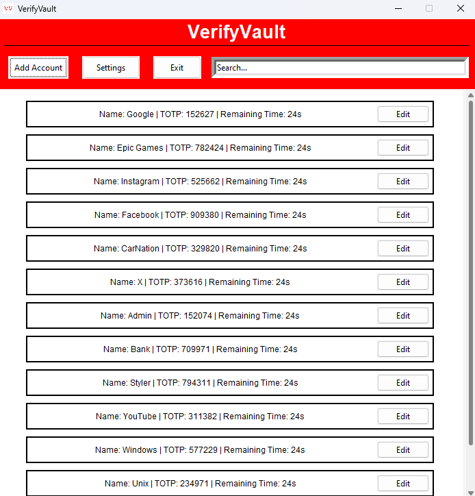
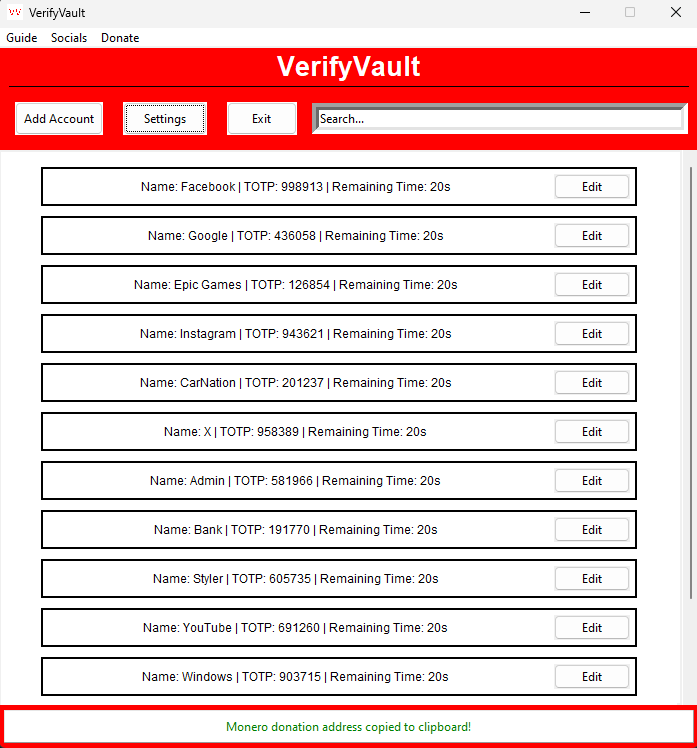
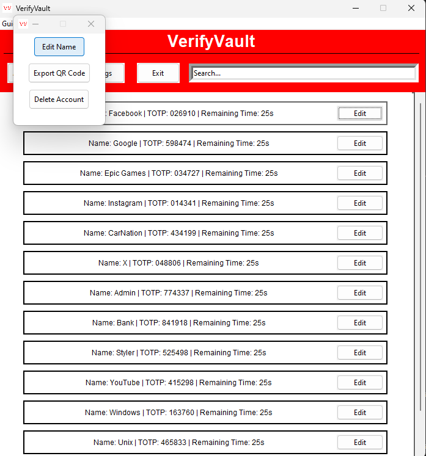
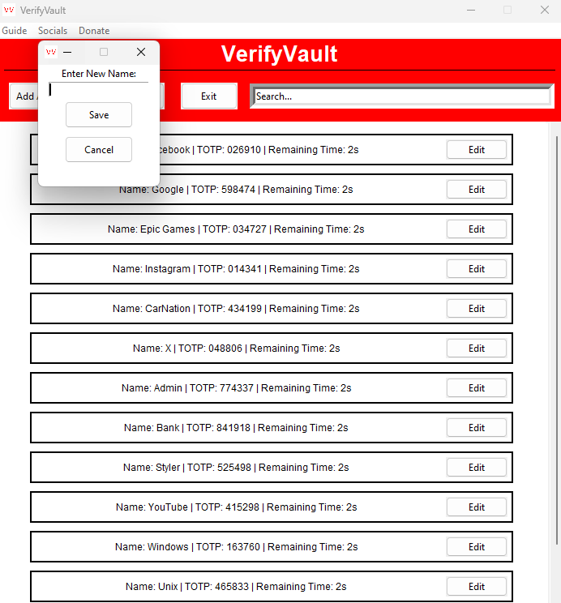
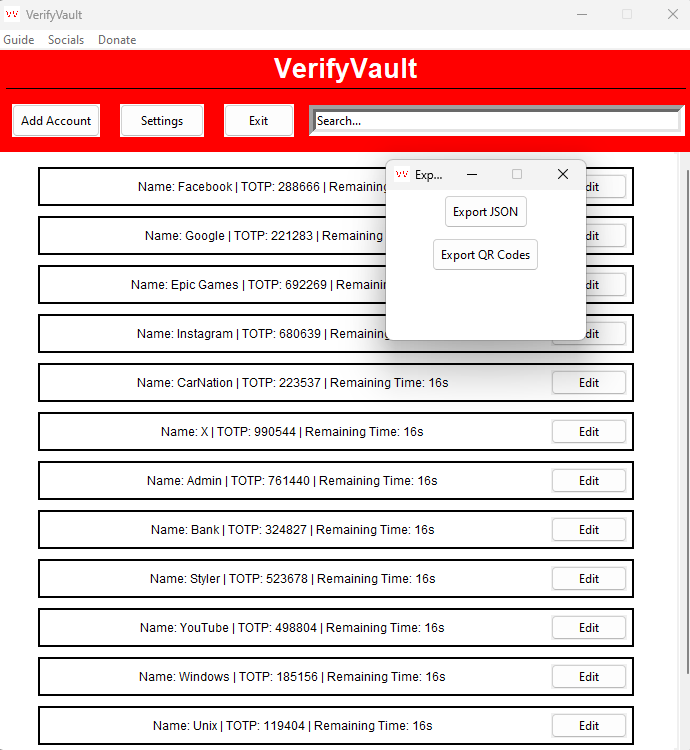
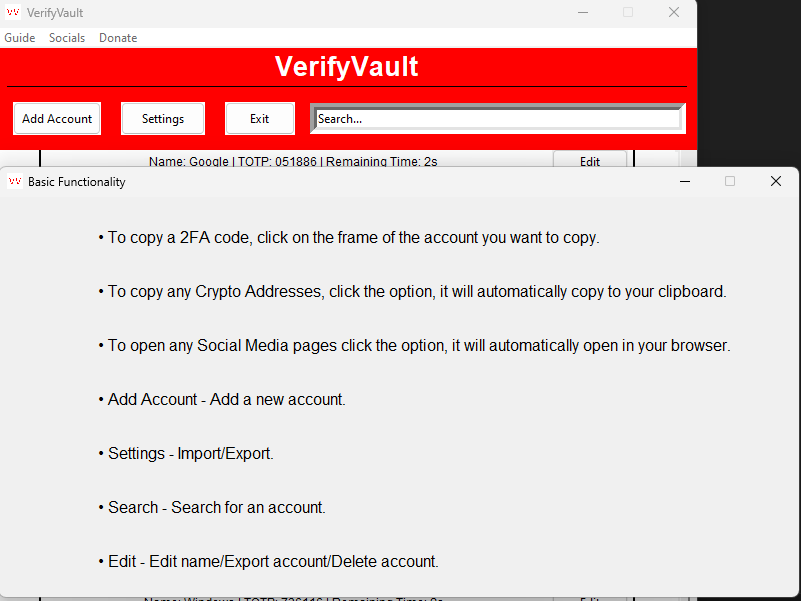
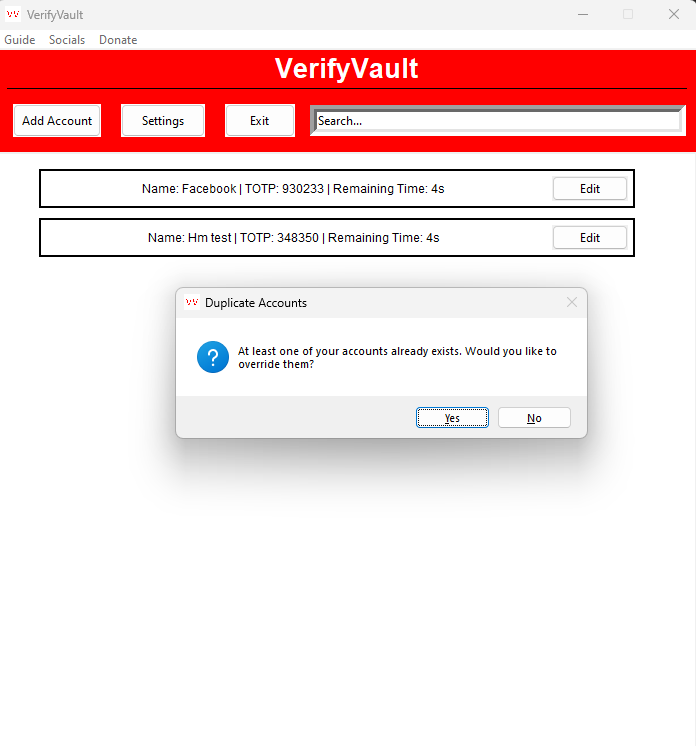
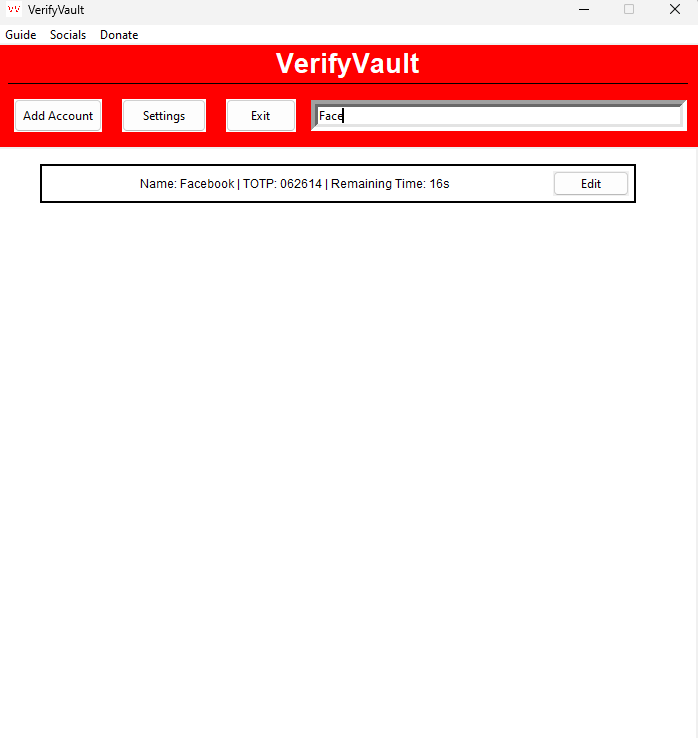

## VerifyVault 

**VerifyVault** is a free and open source 2-Factor Authenticatior for Windows and Linux. The objective of this project is to provide users with a private and transparent 2FA application to secure their accounts. Although this application is in early development, the aim is to provide the most secure 2FA application for users on Windows and Linux.

If you have any questions, please refer the [FAQ](https://github.com/VerifyVault/VerifyVault/blob/main/FAQ.md).

## Socials
    

## Features
- Free
- Offline
- Open Source
- Import/Export accounts
- Export via QR Code

## Contribute
Interested in contributing? Check out the Guidelines [here](https://github.com/VerifyVault/VerifyVault/blob/main/CONTRIBUTE.md).

### Donate
- Monero: 43YvGR6aUTTG6sAf5Ain8WeJ2fUq6iraUV7VWt9UwsBA8bNctzsndUn1b39asA6Eb1MSpRTjeddwuX4nHQqKnwa7EcCHX9Q
- Bitcoin: bc1q3zqeh99p8efuldmn27e44tpajzymafvfyfaqus
- Ethereum: 0x7Af3ee1251c0428b7ba6E1dEaB913ac029e58E1e
- Litecoin: LQakrnCZoSDWioe7qp7SPB9dkP4Tdx4oJd

## License
This project is licensed under the GNU General Public License v3.0. See the LICENSE file for more details.

## Screenshots
        

