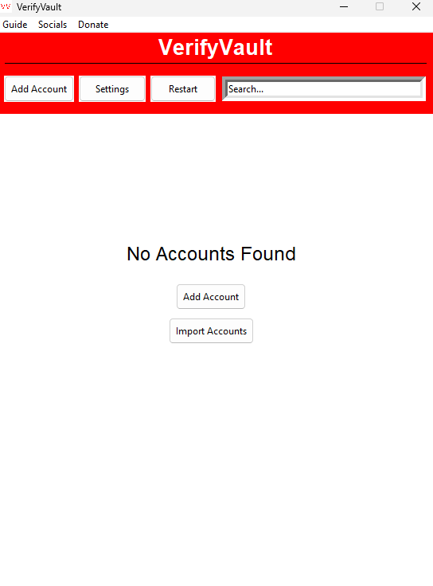
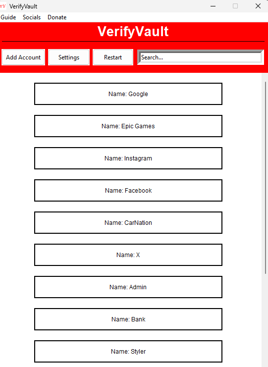
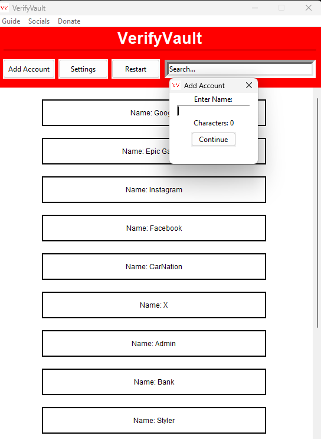
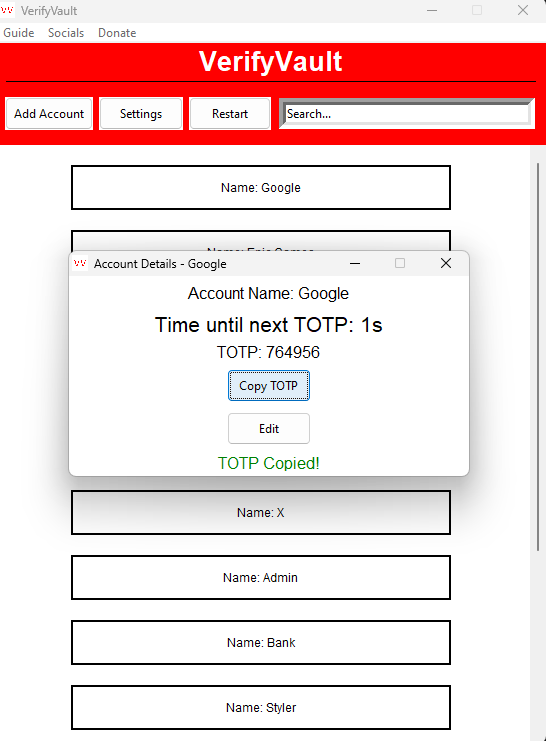
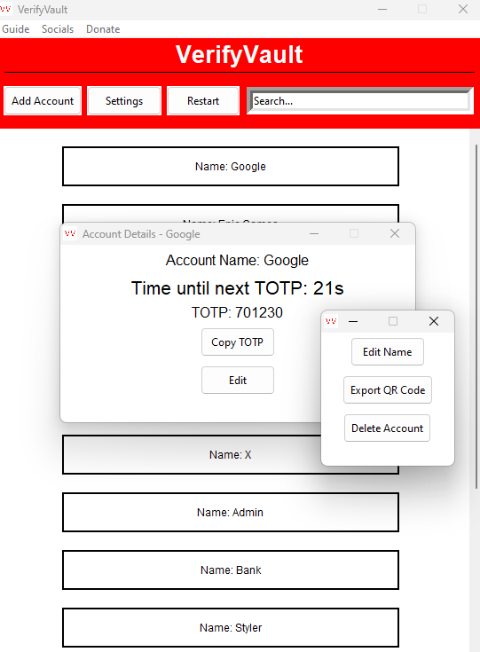
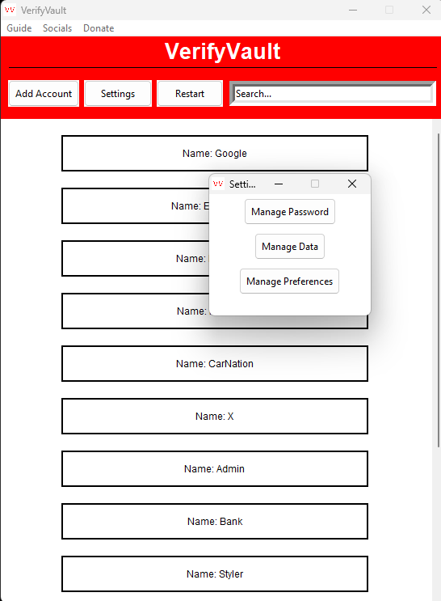
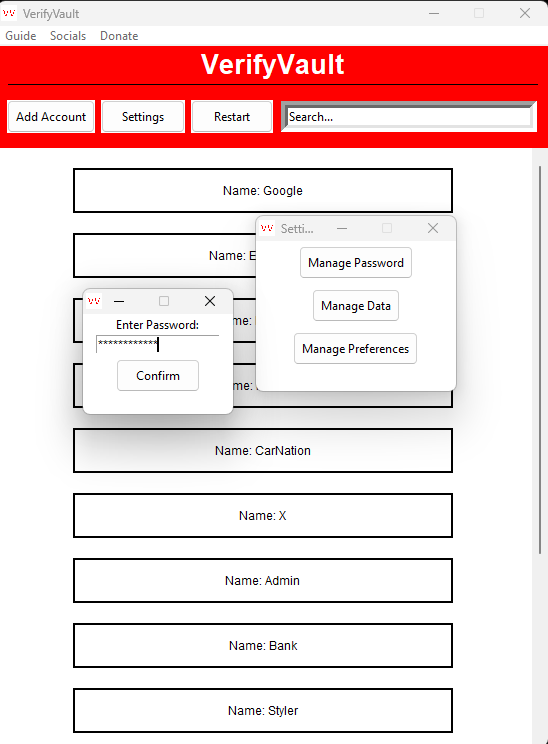
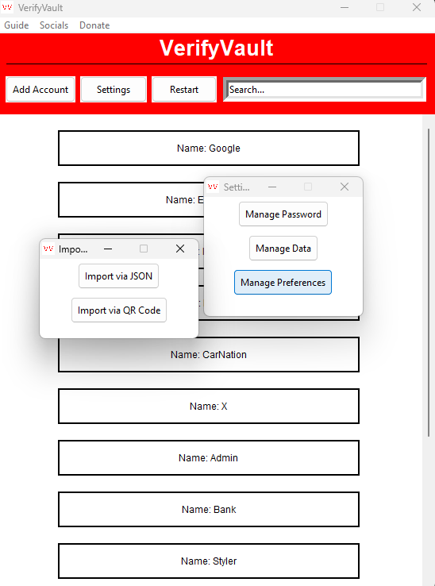
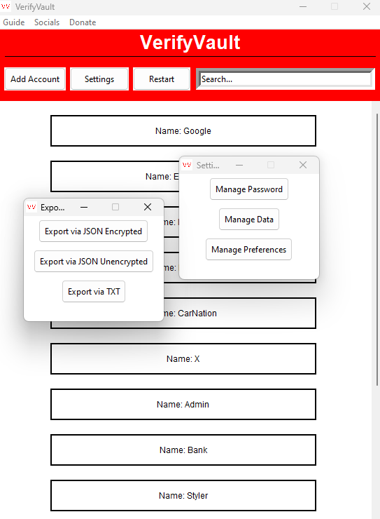
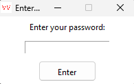

## VerifyVault 

**VerifyVault** is a free and open source 2-Factor Authenticator for Windows and Linux. The objective of this project is to provide users with a private and transparent 2FA application to secure their accounts. Although this application is in early development, the aim is to provide the most secure 2FA application for users on Windows, Linux, and Mac.

If you have any questions, please refer the [FAQ](https://github.com/VerifyVault/VerifyVault/blob/main/FAQ.md).

## Socials
**Developement:**

 

**Socials:**

  

**Chat:**

  

**Blogs:**

 

## Features
- Free
- Offline
- Encrypted
- Open Source
- Password Lock
- Automatic Backups
- Import/Export accounts
- Import/Export via QR Code

## Contribute
Interested in contributing? Check out the Guidelines [here](https://github.com/VerifyVault/VerifyVault/blob/main/CONTRIBUTE.md).

### Donate
- **Monero**: 43YvGR6aUTTG6sAf5Ain8WeJ2fUq6iraUV7VWt9UwsBA8bNctzsndUn1b39asA6Eb1MSpRTjeddwuX4nHQqKnwa7EcCHX9Q
- **Bitcoin**: bc1q3zqeh99p8efuldmn27e44tpajzymafvfyfaqus
- **Ethereum**: 0x7Af3ee1251c0428b7ba6E1dEaB913ac029e58E1e
- **Litecoin**: LQakrnCZoSDWioe7qp7SPB9dkP4Tdx4oJd

## License
This project is licensed under the GNU General Public License v3.0. See the [LICENSE file](https://github.com/VerifyVault/VerifyVault/blob/main/LICENSE) for more details.

## Screenshots - From Beta v0.2.2
 

  

 

 

 
