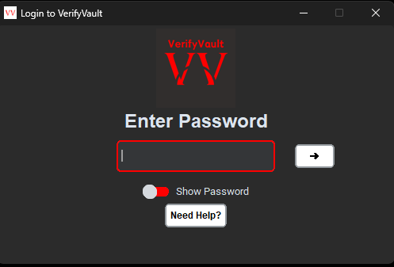
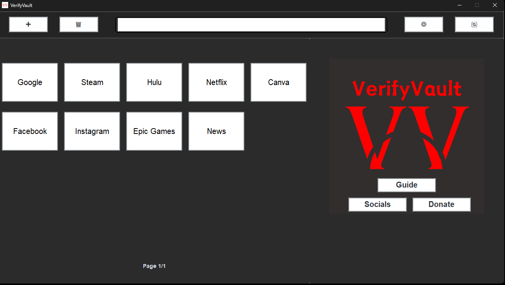
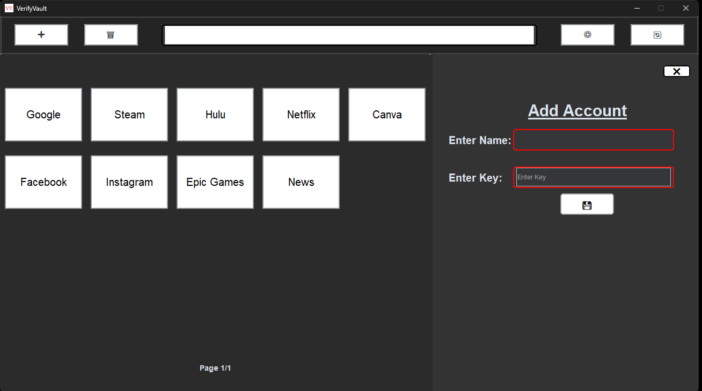
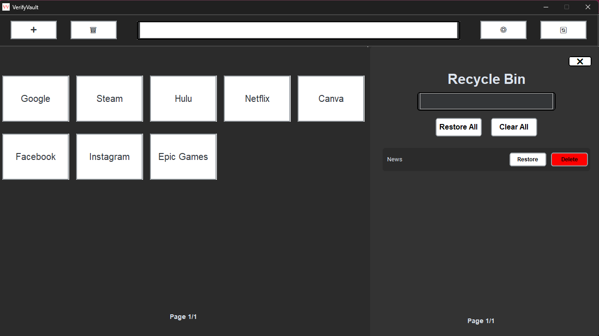
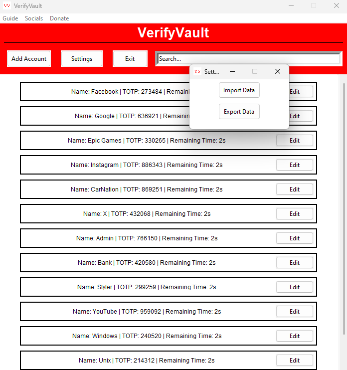
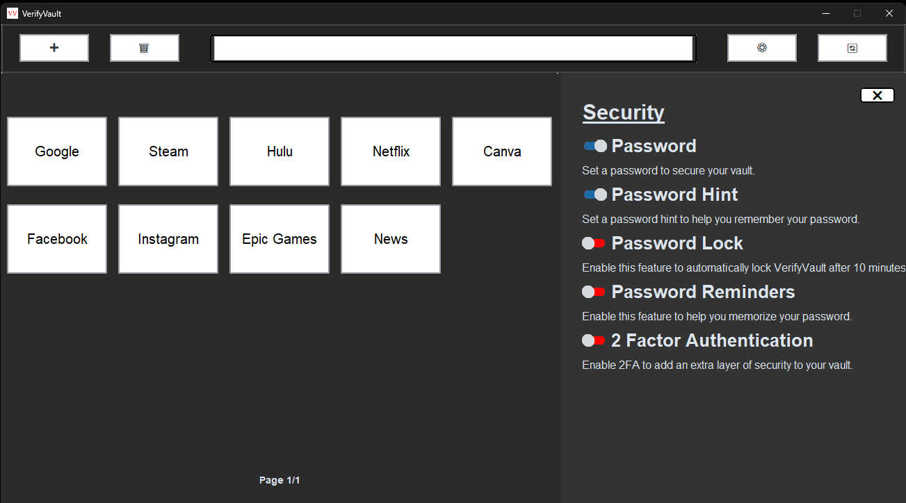

## VerifyVault 

**VerifyVault** is a free and open source 2-Factor Authenticator for Windows and Linux. The objective of this project is to provide users with a private and transparent 2FA application to secure their accounts. Although this application is in early development, the aim is to provide the most secure 2FA application for users on Windows, Linux, and Mac.

If you have any questions, please refer the [FAQ](https://github.com/VerifyVault/VerifyVault/blob/main/FAQ.md).

## Socials
**Developement:**

 

**Socials:**

 

 

## Features
### **Private**
- Free & Open Source
- Offline

### **Secure**
- 2FA
- Encrypted 
- Password Lock
- Password Hints
- Password Reminders

### **Managing Data**
- Automatic Backups
- Import/Export accounts
- Import/Export via QR Code

### **Customization**
- Light/Dark Mode

## Contribute
Interested in contributing? Check out the Guidelines [here](https://github.com/VerifyVault/VerifyVault/blob/main/CONTRIBUTE.md).

### Donate
- **Monero**: 43YvGR6aUTTG6sAf5Ain8WeJ2fUq6iraUV7VWt9UwsBA8bNctzsndUn1b39asA6Eb1MSpRTjeddwuX4nHQqKnwa7EcCHX9Q
- **Bitcoin**: bc1q3zqeh99p8efuldmn27e44tpajzymafvfyfaqus
- **Ethereum**: 0x7Af3ee1251c0428b7ba6E1dEaB913ac029e58E1e
- **Litecoin**: LQakrnCZoSDWioe7qp7SPB9dkP4Tdx4oJd

## License
This project is licensed under the GNU Affero General Public License v3.0. See the [LICENSE file](https://github.com/VerifyVault/VerifyVault/blob/main/LICENSE.md) for more details.

## VerifyVault v1.0
 

  

 

