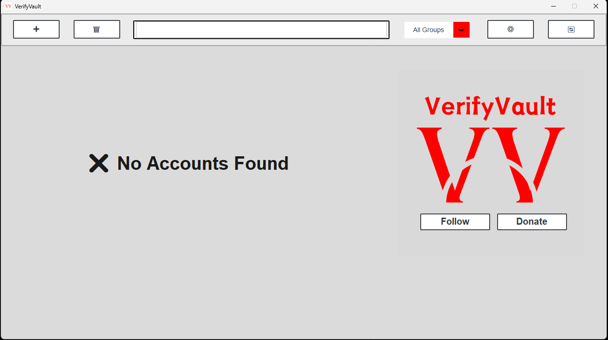
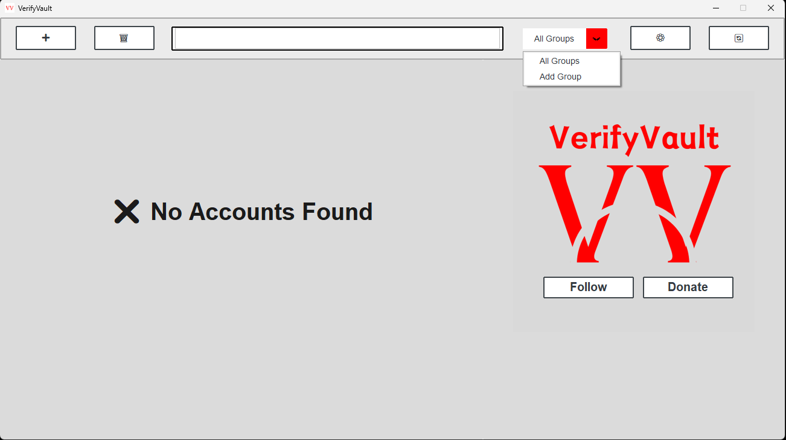
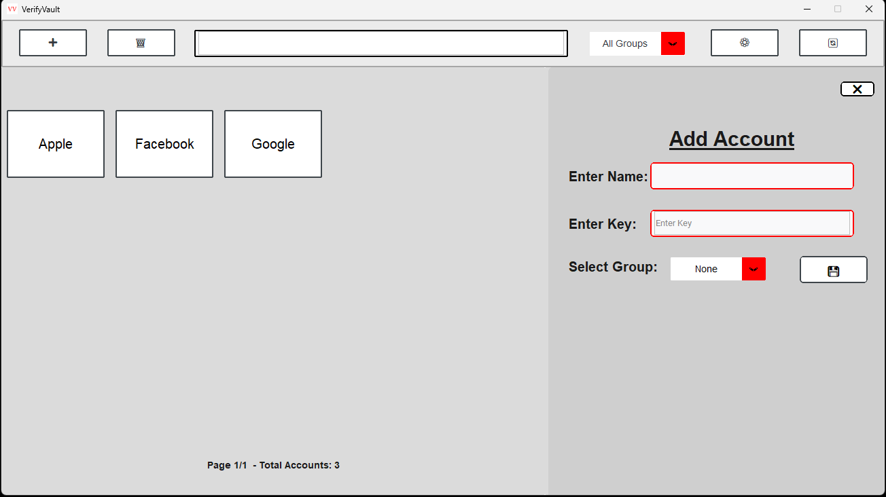
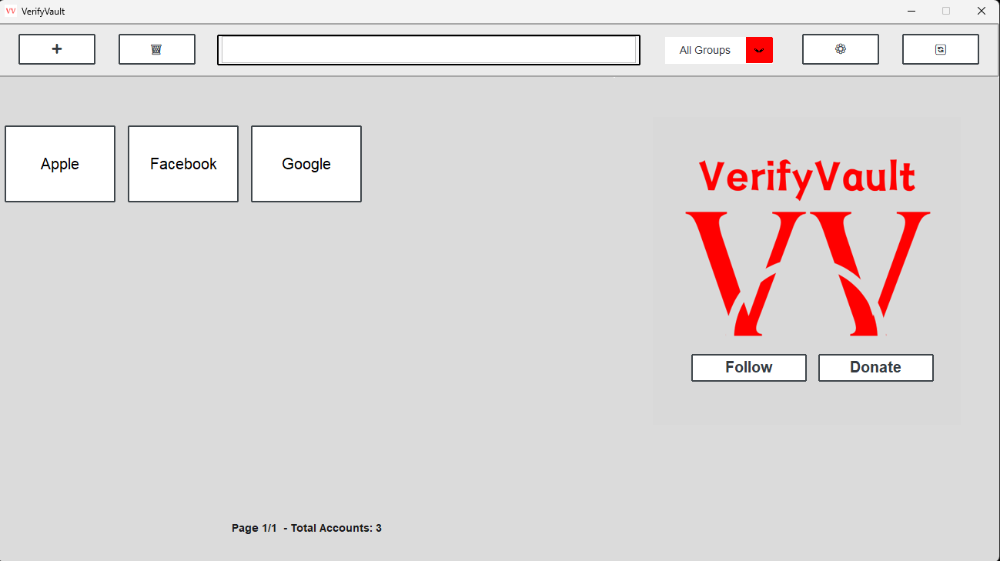
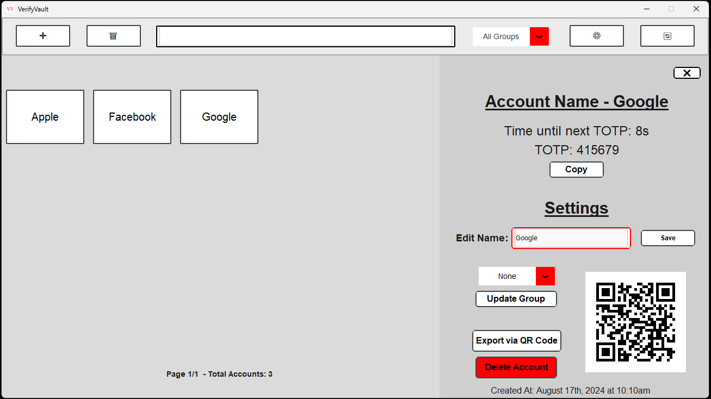
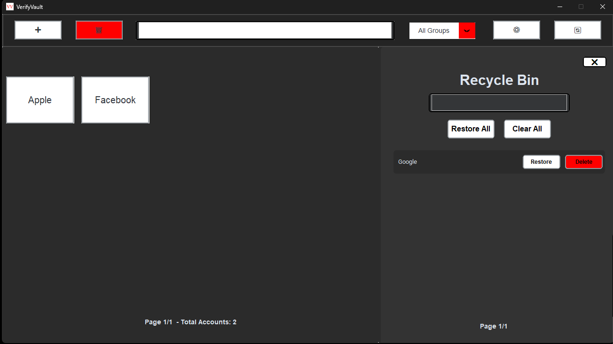
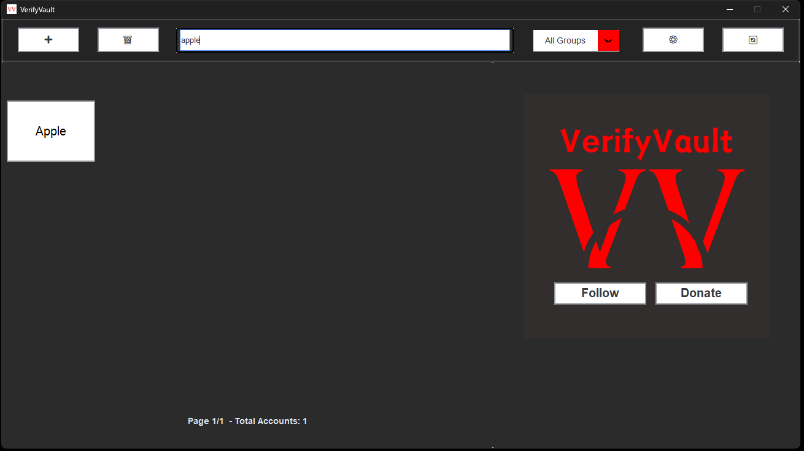
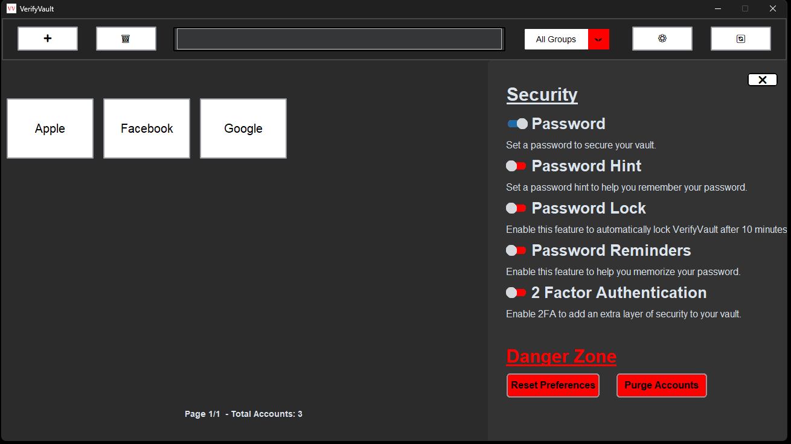
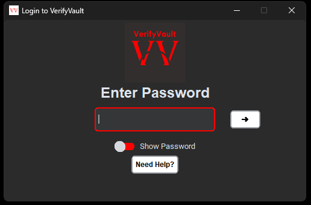

## VerifyVault 

Welcome to **VerifyVault**, a free and open-source 2-factor authenticator designed for desktop use. Our mission is to offer a private and transparent solution for securing your online accounts, while also offering an alternative to proprietary apps such as Authy. Although still in early development, VerifyVault aims to deliver robust security across Windows, Linux, and Mac. Join us on our journey to create the ultimate 2FA tool!

If you have any questions, please refer the [FAQ](https://github.com/VerifyVault/VerifyVault/blob/main/FAQ.md).

## Socials
**Developement:**

 

**Socials:**

    

## Features
### **Private**
- Free & Open Source
- Offline

### **Secure**
- 2FA
- Encrypted 
- Password Lock
- Password Hints
- Password Reminders

### **Managing Data**
- Automatic Backups
- Import/Export accounts
- Import/Export via QR Code

### **Customization**
- Time Format
- Light/Dark Mode

## Contribute
Interested in contributing? Check out the Guidelines [here](https://github.com/VerifyVault/VerifyVault/blob/main/CONTRIBUTE.md).

### Donate
- **Monero**: 43YvGR6aUTTG6sAf5Ain8WeJ2fUq6iraUV7VWt9UwsBA8bNctzsndUn1b39asA6Eb1MSpRTjeddwuX4nHQqKnwa7EcCHX9Q
- **Bitcoin**: bc1q3zqeh99p8efuldmn27e44tpajzymafvfyfaqus
- **Ethereum**: 0x7Af3ee1251c0428b7ba6E1dEaB913ac029e58E1e
- **Litecoin**: LQakrnCZoSDWioe7qp7SPB9dkP4Tdx4oJd

## License
This project is licensed under the GNU Affero General Public License v3.0. See the [LICENSE file](https://github.com/VerifyVault/VerifyVault/blob/main/LICENSE.md) for more details.

## VerifyVault v1.0
  

  

 

 

 

